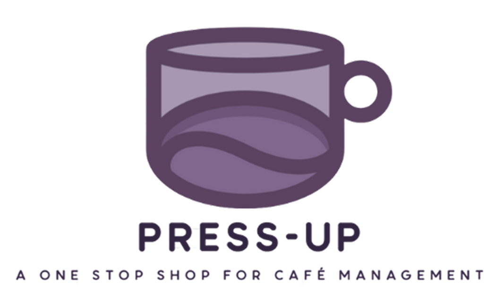

# Project Summary
PressUp forms an all-in-one solution for cafe management, simplifying the complexities of running a small business.  By combining modern technology with an intuitive, user-friendly design and reliable system performance, we aim to empower café owners and streamline daily operations for their teams.

Key Features:
- POS system
- Inventory Management
- Menu Management
- User Management
- Staff Management
- Financial Management
- Analytics & Reporting
- Kitchen Management

All this and more has been created to allow cafe owners to run their small business with ease. The following ReadMe details how it can be utilised, with tips to make this as simple as possible. 


# Team

## 🧠 System Architects

<table>
  <tbody>
    <tr>
      <td align="center" valign="top" width="33%"><a href="https://github.com/fung-alvin"><br /><b>Alvin Fung</b></a><br /><sub><a href="https://github.com/Monash-FIT3170/2025W2-PressUp/commits?author=fung-alvin">afun0005@student.monash.edu</a></sub></td>
      <td align="center" valign="top" width="33%"><a href="https://github.com/djgh1009"><br /><b>Daniel Gower-Hall</b></a><br /><sub><a href="https://github.com/Monash-FIT3170/2025W2-PressUp/commits?author=djgh1009">dgow0002@student.monash.edu</a></sub></td>
      <td align="center" valign="top" width="33%"><a href="https://github.com/chr1st1nabb"><br /><b>Christina Burke Broderick</b></a><br /><sub><a href="https://github.com/Monash-FIT3170/2025W2-PressUp/commits?author=chr1st1nabb">cbur0025@student.monash.edu</a></sub></td>
    </tr>
  </tbody>
</table>

## 📦 Product Managers

<table>
  <tbody>
    <tr>
      <td align="center" valign="top" width="33%"><a href="https://github.com/mitchellaugustini"><br /><b>Mitchell Augustini</b></a><br /><sub><a href="https://github.com/Monash-FIT3170/2025W2-PressUp/commits?author=mitchellaugustini">maug0006@student.monash.edu</a></sub></td>
      <td align="center" valign="top" width="33%"><a href="https://github.com/jacksonwtong"><br /><b>Jackson William Tong</b></a><br /><sub><a href="https://github.com/Monash-FIT3170/2025W2-PressUp/commits?author=jacksonwtong">jton0021@student.monash.edu</a></sub></td>
      <td align="center" valign="top" width="33%"><a href="https://github.com/saraalana"><br /><b>Sara Hopkins</b></a><br /><sub><a href="https://github.com/Monash-FIT3170/2025W2-PressUp/commits?author=saraalana">shop0007@student.monash.edu</a></sub></td>
    </tr>
    <tr>
      <td align="center" valign="top" width="33%"><a href="https://github.com/Reemm1"><br /><b>Reem El Machtoub</b></a><br /><sub><a href="https://github.com/Monash-FIT3170/2025W2-PressUp/commits?author=Reemm1">relm0003@student.monash.edu</a></sub></td>
      <td align="center" valign="top" width="33%"><a href="https://github.com/bingmo767"><br /><b>Bingmo Li</b></a><br /><sub><a href="https://github.com/Monash-FIT3170/2025W2-PressUp/commits?author=bingmo767">blii0059@student.monash.edu</a></sub></td>
      <td align="center" valign="top" width="33%"><a href="https://github.com/srao0008"><br /><b>Simran Rao</b></a><br /><sub><a href="https://github.com/Monash-FIT3170/2025W2-PressUp/commits?author=srao0008">srao0008@student.monash.edu</a></sub></td>
    </tr>
  </tbody>
</table>

## 🚂 Release Train Engineers

<table>
  <tbody>
    <tr>
      <td align="center" valign="top" width="33%"><a href="https://github.com/jmark-9"><br /><b>Jessica Mark</b></a><br /><sub><a href="https://github.com/Monash-FIT3170/2025W2-PressUp/commits?author=jmark-9">jmar00696@student.monash.edu</a></sub></td>
      <td align="center" valign="top" width="33%"><a href="https://github.com/JayReeMarine"><br /><b>Jaeyun Ree</b></a><br /><sub><a href="https://github.com/Monash-FIT3170/2025W2-PressUp/commits?author=JayReeMarine">jree0010@student.monash.edu</a></sub></td>
      <td align="center" valign="top" width="33%"><a href="https://github.com/JeremyOckerby1"><br /><b>Jeremy Ockerby</b></a><br /><sub><a href="https://github.com/Monash-FIT3170/2025W2-PressUp/commits?author=JeremyOckerby1">jock0003@student.monash.edu</a></sub></td>
    </tr>
    <tr>
      <td align="center" valign="top" width="33%"><a href="https://github.com/Bhattman1"><br /><b>Milind Bhatt</b></a><br /><sub><a href="https://github.com/Monash-FIT3170/2025W2-PressUp/commits?author=Bhattman1">mbha0018@student.monash.edu</a></sub></td>
      <td align="center" valign="top" width="33%"><a href="https://github.com/riyav1602"><br /><b>Riya Vyas</b></a><br /><sub><a href="https://github.com/Monash-FIT3170/2025W2-PressUp/commits?author=riyav1602">rvya0001@student.monash.edu</a></sub></td>
      <td align="center" valign="top" width="33%"><a href="https://github.com/brandttru"><br /><b>Brandon Truong</b></a><br /><sub><a href="https://github.com/Monash-FIT3170/2025W2-PressUp/commits?author=brandttru">btru0002@student.monash.edu</a></sub></td>
    </tr>
  </tbody>
</table>

# Development

## Tech Stack

This project makes use of the following core technologies:

1. [React](https://react.dev/) - Front-end library
2. [Meteor.js v3](https://meteor.com/) - Full-stack framework
3. [TypeScript](https://typescriptlang.org/) - Programming language of choice
4. [MongoDB](https://mongodb.com/) - Database
5. [Docker](https://docker.com/) - Reproducible deployment

To work on this project you should at least familiarise yourself with each of these. An understanding of web fundamentals is also a pre-requisite, including HTML, JavaScript, and CSS knowledge. Recommended guides/documentation for the above technologies are:

**React**

- Quickstart: <https://react.dev/learn>

**Meteor.js:**

- Introduction: <https://docs.meteor.com/about/what-is.html>
- Installation: <https://docs.meteor.com/about/install.html>
- Quickstart Project: <https://docs.meteor.com/about/web-apps.html> and <https://docs.meteor.com/tutorials/react/index.html>

**TypeScript:**

- Follow the "Get Started" guide that best describes you: <https://www.typescriptlang.org/docs/>

**MongoDB:**

- What is MongoDB?: <https://www.mongodb.com/company/what-is-mongodb>

> [!NOTE]
> The MongoDB site primarily sells their cloud platform "Atlas". You will learn MongoDB best by using it in the project. The above should be read to gain a rough understanding of its philosophy.

**Docker:**

- What is Docker?: <https://docs.docker.com/get-started/docker-overview/>
- Introduction: <https://docs.docker.com/get-started/introduction/>

## Running the Project

In order to run the project for development you should do the following:

1. Install [Meteor](https://docs.meteor.com/about/install.html).
2. Clone the project and navigate into the cloned directory.
3. After ensuring that `meteor` is on your PATH run `meteor npm install`.
4. Run `meteor npm start` to launch a local server to test against.

> [!WARNING]
> Initial builds can take a long time depending on the machine.

> [!TIP]
> Meteor can be fragile. If you find yourself in an unexpected state with many errors try to restart; if all else fails running the following works as a last resort fix (but clears local database, removes modules, and requires a rebuild afterwards):
>
> ```bash
> rm -rf node_modules
> rm package-lock.json
> npm cache clean --force
> npm install
> meteor reset --db
> ```

## Making Changes

The `main` branch represents the current "production ready" state of the codebase. Pushing directly to `main` is prevented by a branch protection rule.

Instead a [Trunk Based Development](https://www.atlassian.com/continuous-delivery/continuous-integration/trunk-based-development) approach is taken where features are developed on short lived feature branches, a PR is created for them once the feature is ready, the PR is reviewed and later approved by a maintainer that didn't develop the feature, and the branch is merged into `main`.

Branches should be prefixed with an indicator for their purpose and descriptively named, for example:

- `feature/sign-in-page-uplift`
- `refactor/user-abstraction`
- `hotfix/home-page-header-issue`

Commits should be short but descriptive. Limit to 50 characters and format as having the first letter capitalised but _don't_ end with a period.

## Code Quality

Before committing changes, run `npm run fix` to lint and format your code. Note that some problems may require manual resolution. All PRs are automatically checked for code quality and must pass before merging.

This check is performed using the workflow found at `.github/workflows/code-quality.yml`.

## Versioning Strategy

This project versions based on the [Semantic Versioning](https://semver.org/) standard. Each release is associated with a version number vX.Y.Z (e.g. 1.2.3) where:
- X (Major): denotes significant widespread or breaking changes.
- Y (Minor): indicates implementation of a new feature.
- Z (Patch): representing a bug fix or small adjustment.
Given that this is a web application major version updates are expected to be very infrequent. However, the full versioning scheme is maintained for consistency.

Versioning is performed using a GitHub Actions workflow located at `.github/versioning.yml` which runs on PR merge. The workflow makes use of git tags and the branch prefix to determine versioning:
- A prefix of `major/` will increment the major version (and reset minor and patch to zero).
- A prefix of `fix/`, `bugfix/`, `bug/` or `hotfix/` will increment the patch version
- All other prefixes increment the minor version (and reset the patch version).
Minor patch branches are expected to almost always be prefixed with `feature/`.

The workflow also creates a GitHub release with the new version and a list of commits included in the PR with attribution. As a result contributors are encouraged to make descriptive but concise commit messages.

# Deployment

We have automated deployment setup on [Render](https://render.com/), the deployed application can be accessed at <https://pressup.onrender.com/>. We are using the free tier so the application will go to sleep after a period of inactivity with wake up usually taking a few minutes.

Deployment is performed automatically whenever code is pushed to`main` using the workflow found at `.github/workflows/deploy.yml` and makes use of the GitHub secret `RENDER_DEPLOY_HOOK_URL` which is provided on the Render dashboard. Render makes use of the `Dockerfile` in the repository to perform deployment.

The database is hosted on a free MongoDB Atlas instance. The connection string of this instance is injected into the application at runtime using an environment variable stored on Render.

## Local Docker

If you want to test the conditions of the Render environment locally you can perform the following to run the Docker image. Note that this will instantiate a local MongoDB instance within the container unless you provide the `MONGO_URL` environment variable.

1. Install [Docker](https://docs.docker.com/engine/install/)
2. Run `docker compose up`
